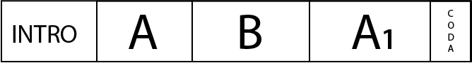
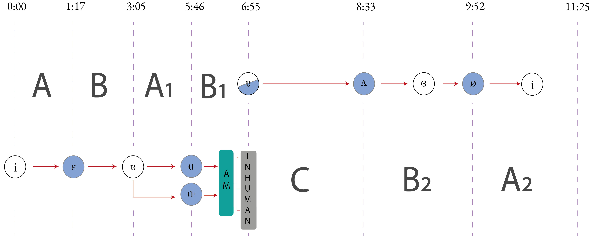
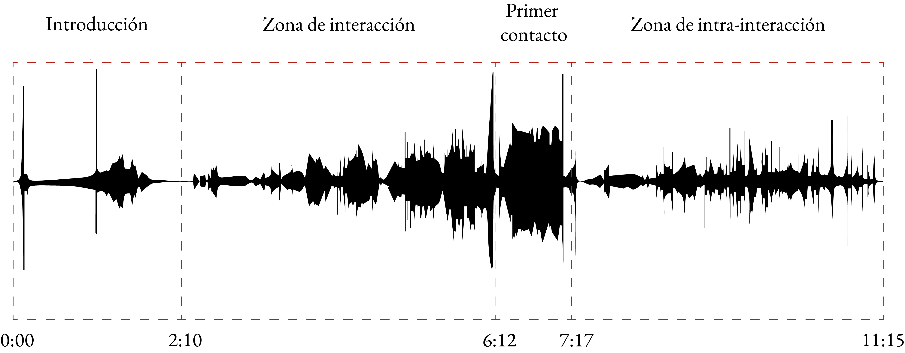

# Entrelazados

En esta página se puede encontrar todos los recursos audiovisuales y de código de mi trabajo Entrelazados: el posthumanismo en la música electroacústica desarrollado en la ENES Morelia como parte de mi exámen de titulación en la licenciatura de Música y Tecnología Artística.


## Piezas

1. [**Preludio(Alienación)**](pages/preludio.md)
3. [**non-Human**](pages/non-Human.md)
4. [**LCSE**](pages/LCSE.md)
5. [**Intertwined**](pages/intertwined.md)

# Herramientas de partida
[https://github.com/mezaga/entrelazados/blob/1f70368b12eaad5e72bdcb3526fdab9a95c08a7a/random_walk.scd]
```
~valores = 71;
~datos = Array.exprand(11,1,100).sort;
//~datos.plot
~pezos = ~datos/~datos.sum;
~permutacion = Array.fill(12,{arg i;~pezos.rotate(i.neg).postln;});
~sel =  Array.new(60);
~contador = 0;
~index = 0;
~sel =  Array.new(290);

~listA = Array.fill(~valores ,{|i| i });
~listB = Array.fill(12, {|i| ~valores/11 * i });
~listB.size;
~cuenta = 0;
40/11
~contador = 0;
//~sel = [];
x = ~valores.do({arg i, item;
	var val;
	~contador = i;

	if (~contador >= ~listB[~cuenta],
		{~cuenta = ~cuenta+1;
			~pesos = ~permutacion[~cuenta]},
		{~cuenta};
	);

	y = [~bilabiales[~bilabiales.size.rand].bufnum, ~labiodentales[~labiodentales.size.rand].bufnum, ~dental[~dental.size.rand].bufnum,
		~alveolares[~alveolares.size.rand].bufnum, ~postalveolares[~postalveolares.size.rand].bufnum, ~retroflex[~retroflex.size.rand].bufnum, ~palatales[~palatales.size.rand].bufnum, ~velares[~velares.size.rand].bufnum, ~uvulares[~uvulares.size.rand].bufnum, ~faringe[~faringe.size.rand].bufnum, ~glotis[~glotis.size.rand].bufnum].wchoose(~pesos);

	[y,~pesos].postln;
		~sel.insert(~contador, y);

});

~sel.plot;

t = Task({70.do({arg i, count;
	var val;
	~contador = i;
	~pesos = ~permutacion;
	val = (1 + ~contador);
//	if (~contador == 2, {~pesos = ~permutacion[1]; "taco".postln;});
	if (~contador.odd, {
		~index = ~index + 1;
		~pesos = ~permutacion[~index];
		"taco".postln;},{
		~pesos = ~permutacion[~index];
		"soy par".postln;
	});
		~contador.postln;
0.1.wait;
	x = [~bilabiales[~bilabiales.size.rand].bufnum, ~labiodentales[~labiodentales.size.rand].bufnum, ~dental[~dental.size.rand].bufnum,
		~alveolares[~alveolares.size.rand].bufnum, ~postalveolares[~postalveolares.size.rand].bufnum, ~retroflex[~retroflex.size.rand].bufnum, ~palatales[~palatales.size.rand].bufnum, ~velares[~velares.size.rand].bufnum, ~uvulares[~uvulares.size.rand].bufnum, ~faringe[~faringe.size.rand].bufnum, ~glotis[~glotis.size.rand].bufnum].wchoose(~pesos.flat);
	//x.postln;
	//x.size
	[x,~pesos].postln;
	~sel.insert(~contador, x);
	0.5.wait;

})});

t.start;

```
[[]]

## Alienación
Preludio (Alienación)                      					10’ 26’’
Electrónica multicanal
En esta primera pieza del ciclo se emula el proceso de alienación humana, celebrando la alianza humano-naturaleza-máquina. El elemento no-humano se encuentra representado por un acorde resultante de la superposición de las sílabas que conforman la palabra Xeno y surge de la conceptualización de un lenguaje abiológico capaz de producir sinogramas sonoros derivados de su incorporeidad tecnológica. El elemento de la naturaleza es representado por paisajes sonoros y fuentes reconocibles que juegan un papel de balance y contextualización. Por último, la exploración fonética y su relación con la granulación y el espacio hace referencia a un lenguaje resultante de la interacción entre los distintos elementos de dicha alianza. La pieza se encuentra permeada por momentos de incomodidad y presagio, donde los elementos fonéticos en el devenir de los 10 minutos pasan por un proceso de alienación, tratando de emerger y organizarse, despojándose de sus cualidades humanas, en este caso, de sus cualidades tímbricas y de sintaxis. Los elementos más reconocibles a la escucha nos ponen en primer plano las diferentes fuerzas que están presentes en la cotidianidad y permiten al oyente dislocarse momentáneamente del centro de las cosas.




### Audio 1
Acorde Xeno
<audio controls style="width: 100%; padding: 0.5%">
        <source src="https://github.com/mezaga/entrelazados/blob/main/XENO_ACORDE_VOCES.mp3">
    </audio>

### Audio 2
Textura inhuman
<audio controls style="width: 100%; padding: 0.5%">
        <source src="/Users/mezaga93/entrelazados/textura_inhuman3.mp3">
    </audio>

## non-Human

non-Human 									11’ 25’’
Electrónica multicanal
non-Human es una pieza que plantea la asimilación y creación de un lenguaje posthumano. El proceso de asimilación es aplicado al poema sonoro dadaísta UrSonate (1932) de Kurt Schwitters, el cual fue analizado con cadenas de Markov para extraer sus patrones intrínsecos y extrapolarlos a un nuevo lenguaje cyborg conformado por los fonemas utilizados en Alienación. Otro elemento principal es la sonificación de fragmentos de este lenguaje. Estos elementos se intercalan y paulatinamente se van afectando cada vez más hacia el final de la obra, compartiendo rasgos y materiales entre las secciones. Por otro lado, existe una segunda capa que funge como acompañamiento, la cual crea distintas texturas basadas en vocales que transicionan lentamente a lo largo del esquema seccional, haciendo un contrapunto formal con la primera capa. La pieza en general, puede describirse como una pieza estática y lenta, con algunos momentos llenos de energía que se autorregulan, planteando la metáfora de interacción entre el ser cyborg, la tecnología y naturaleza donde la modulación funge el papel de alienación entre las fronteras del lenguaje puramente humano con la finalidad de establecer un diálogo entre las partes.




## LCSE
Los Ciborgs Son Éter 							         15’ 45’’
Sistema interactivo e intérprete
Los Ciborgs Son Éter (LCSE) busca presentar al cyborg del ciclo emancipado y tendiendo puentes horizontales a través de la transcorporeidad con su entorno formado por los agentes humano, tecnología (máquina) y naturaleza. El cyborg por su esencia híbrida y etérea, puede entenderse como un meta-agente resultante de uno de los acoplamientos exitosos de agentes máquina y humano de la red transcorpórea. En esta pieza se plantea la colaboración de un intérprete humano con un sistema interactivo que aprende de los parámetros modificados por el intérprete durante esta interacción y los aplica a futuras interpretaciones. Esta idea surgió por el interés de dar agencia al sistema para representar al agente máquina. A grandes rasgos, esta parte del ciclo está permeada de procesos iterativos y recursivos en todos los niveles estructurales desde lo micro hasta lo supraestructural. La pieza está organizada como una forma rondó variada donde se manifiestan sonidos granulares de distintas fuentes tanto en espacios sonoros como en secciones de improvisación. Hacia el final, se presenta una sección contrastante donde se genera una nube granular que va aumentando de densidad y se conforma de la conjunción de los materiales pertenecientes al humano y a la naturaleza.


## Intertwined
Intertwined 								          11’ 15’’
Electrónica
En el ámbito del ciclo, esta pieza hace referencia a múltiples elementos sonoros y procesos. Uno de ellos es el concepto de alienación y su poder de transformación que vuelve inteligible los nudos de la transcorporeidad. Aparte de esto, Intertwined presenta los conceptos de agencia e intra-acción de Karen Barad, y los divide en tres estratos que pueden desenvolverse en el espacio-tiempo transcorpóreo musical. Macroestucturalmente la pieza puede entenderse como una forma binaria con carácter calmado y meditativo donde los sonidos se integran y transicionan lentamente de uno a otro. En la primera parte se presentan elementos interactuando con la representación de seres corpóreos, tales como los sonidos de origen animal y fonemas sin modificación. Entre secciones, la pieza adquiere un carácter rítmico, el cual sutilmente transforma la atmósfera hacia un muro de sonidos que inmediatamente se fragmenta en sus partes constitutivas presentando finalmente en la segunda sección al cyborg que dialoga por primera vez de una manera calmada y en armonía, situándose en el centro, reconociendo la agencia del entorno y coexistiendo con la naturaleza y los sonidos urbanos.




### Audio 1
transacordes
<audio controls style="width: 80%; padding: 0.5%">
        <source src="https://github.com/mezaga/entrelazados/blob/main/XENO_ACORDE_VOCES.mp3">
    </audio>


<audio controls style="width: 20%; padding: 0.5%">
        <source src="https://github.com/mezaga/guitar_VAE/raw/main/versiones_viejas/folder/dataset_examples/Bridge_6-0.wav">
    </audio>
    
    <audio controls style="width: 20%; padding: 0.5%">
        <source src="https://github.com/mezaga/guitar_VAE/raw/main/versiones_viejas/folder/dataset_examples/bridge_Middle_6-0.wav">
    </audio> 
    <audio controls style="width: 20%; padding: 0.5%">
        <source src="https://github.com/mezaga/guitar_VAE/raw/main/versiones_viejas/folder/dataset_examples/middle_6-0.wav">
    </audio>
    <audio controls style="width: 20%; padding: 0.5%">
        <source src="https://github.com/mezaga/guitar_VAE/raw/main/versiones_viejas/folder/dataset_examples/Middle_Neck6-0.wav">
    </audio>
    <audio controls style="width: 20%; padding: 0.5%">
        <source src="https://github.com/mezaga/guitar_VAE/raw/main/versiones_viejas/folder/dataset_examples/Neck_6-0.wav">
    </audio>
