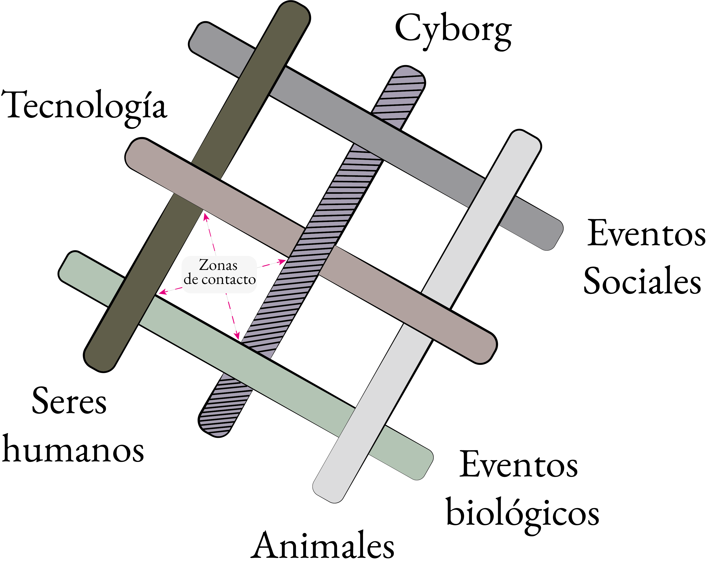

# Los Ciborgs Son Éter (LCSE) 	
### Duración: 15’ 45’’
### Sistema interactivo e intérprete

Los Ciborgs Son Éter (LCSE) busca presentar al cyborg del ciclo emancipado y tendiendo puentes horizontales a través de la transcorporeidad con su entorno formado por los agentes humano, tecnología (máquina) y naturaleza. El cyborg por su esencia híbrida y etérea, puede entenderse como un meta-agente resultante de uno de los acoplamientos exitosos de agentes máquina y humano de la red transcorpórea. En esta pieza se plantea la colaboración de un intérprete humano con un sistema interactivo que aprende de los parámetros modificados por el intérprete durante esta interacción y los aplica a futuras interpretaciones. Esta idea surgió por el interés de dar agencia al sistema para representar al agente máquina. A grandes rasgos, esta parte del ciclo está permeada de procesos iterativos y recursivos en todos los niveles estructurales desde lo micro hasta lo supraestructural. La pieza está organizada como una forma rondó variada donde se manifiestan sonidos granulares de distintas fuentes tanto en espacios sonoros como en secciones de improvisación. Hacia el final, se presenta una sección contrastante donde se genera una nube granular que va aumentando de densidad y se conforma de la conjunción de los materiales pertenecientes al humano y a la naturaleza.

