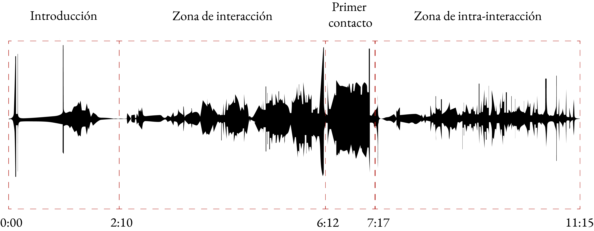

# Intertwined						          
### Duración: 11’ 15’’
### Electrónica

En el ámbito del ciclo, esta pieza hace referencia a múltiples elementos sonoros y procesos. Uno de ellos es el concepto de alienación y su poder de transformación que vuelve inteligible los nudos de la transcorporeidad. Aparte de esto, Intertwined presenta los conceptos de agencia e intra-acción de Karen Barad, y los divide en tres estratos que pueden desenvolverse en el espacio-tiempo transcorpóreo musical. Macroestucturalmente la pieza puede entenderse como una forma binaria con carácter calmado y meditativo donde los sonidos se integran y transicionan lentamente de uno a otro. En la primera parte se presentan elementos interactuando con la representación de seres corpóreos, tales como los sonidos de origen animal y fonemas sin modificación. Entre secciones, la pieza adquiere un carácter rítmico, el cual sutilmente transforma la atmósfera hacia un muro de sonidos que inmediatamente se fragmenta en sus partes constitutivas presentando finalmente en la segunda sección al cyborg que dialoga por primera vez de una manera calmada y en armonía, situándose en el centro, reconociendo la agencia del entorno y coexistiendo con la naturaleza y los sonidos urbanos.

### Audio 6
Alianza
<audio controls style="width: 100%; padding: 0.5%">
        <source src="https://github.com/mezaga/entrelazados/blob/main/XENO_ACORDE_VOCES.mp3">
    </audio>
### Audio 7
Filtrado de formantes
<audio controls style="width: 100%; padding: 0.5%">
        <source src="../audios/filtrado_formantes.mp3">
    </audio>
